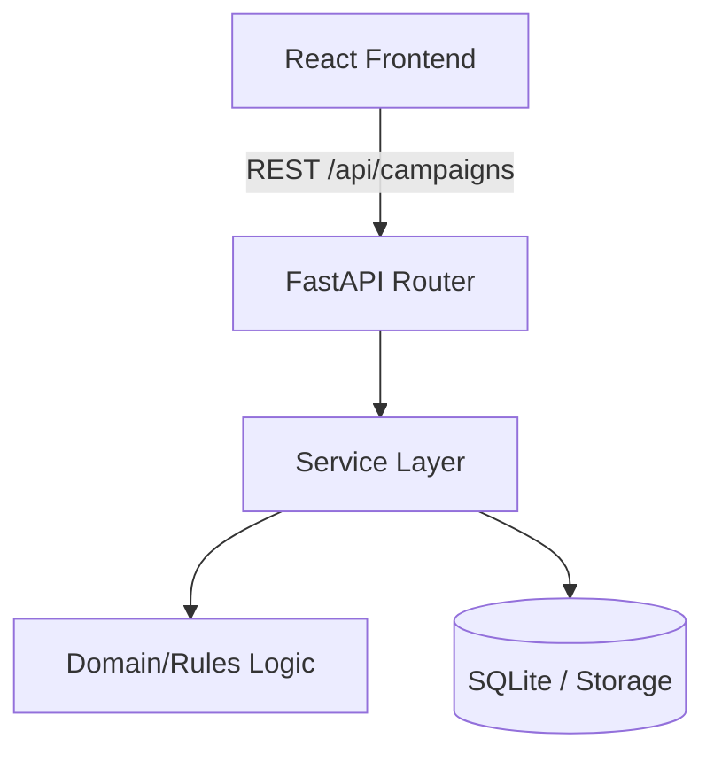

# Architecture & Reasoning

## System Diagram

## Why this Stack?

### Frontend: React + Vite + React Query + Tailwind
- **React**: Industry standard with highly reusable component model.
- **Vite**: Ultra-fast hot module replacement.
- **React Query**: Perfect for asynchronous state management, removing the need for `useEffect` data fetching boilerplates.
- **Tailwind**: Enables fast, utility-first minimal styling without maintaining complex `.css` files.

### Backend: FastAPI + Pydantic + SQLite
- **FastAPI**: Incredibly fast and automatically generates OpenAPI (Swagger) documentations that define strict contracts.
- **Pydantic**: Type-safety at runtime. Ensures payloads strictly match the expected Schema before processing them. 
- **Domain Layer Isolation**: The rule evaluation logic (`rules.py`) does not know about the HTTP routes or database, making it 100% unit-testable.

## API Contracts
- **POST `/api/campaigns`**
  - Payload: `{ name, budget, audience, rule }`
  - Response: Saves to DB and returns ID with campaign data.
- **POST `/api/campaigns/:id/simulate`**
  - Requires valid campaign ID.
  - Response: `{ campaignId, performance: {...}, simulation: { triggered: boolean, action: string } }`

## Production Readiness Trade-offs
To launch this to production, the following evolutions would be required:
1. **Data Store**: Move from SQLite to a managed PostgreSQL cluster.
2. **Message Queues**: If campaigns require heavy processing for simulations, using Celery + Redis or an Event Bus to handle background jobs.
3. **Secrets Management**: Using `.env` via Docker / Kubernetes secrets deployment instead of hardcoded configs.
4. **Observability**: Adding Datadog or Prometheus telemetry.
